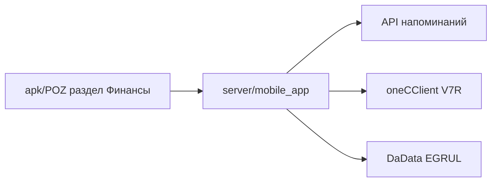

# Финансы: полный план переноса в мобильное приложение

Документ описывает **весь раздел `/finances`** из `server/telegram_dealer_bot` для переноса в `apk/POZ` + `server/mobile_app`.

> **История файла:** ранее здесь был только сценарий «Заказать бухгалтерскую сверку». Теперь это **единый план раздела «Финансы»**: бух. сверка, остаток на счёте, выставить счёт (`V7R`), регистрация холдинга (DaData + анкета).

**Граница с «Сверка»:** пункт **«Сверка финансовая»** в меню `/verification` — это **другой** `typeReminders` и другой UX; не смешивать эндпоинты. См. `Сверка_полный_план_переноса_в_mobile_app.md`, п. 3.5.

---

## 1) Источники текущей логики

| Назначение | Файл |
|------------|------|
| Меню и все обработчики | `server/telegram_dealer_bot/queryLines/finances/finances.js` |
| Маршруты callback | `server/telegram_dealer_bot/helpers/chatCommandHandler.js` — `/finances`, `/accounting_reconciliation`, `/finances_remainder`, `/issue_invoice`, `/add_holding` |
| Ввод текста (бух. сверка, счёт, холдинг) | `server/telegram_dealer_bot/routes/auth.js` — флаги `awaitingFinancesAccountingReconciliation`, `awaitingIssueInvoice`, `addHolding`, … |
| 1С, напоминания, DaData | `server/telegram_dealer_bot/helpers/api.js` — `sendRequest1C`, `createReminder`, `getMppByCompany`, `getCompanyDataEGRUL` |
| Сброс сессии | `server/telegram_dealer_bot/helpers/buttonCancel.js` |

---

## 2) Меню «Финансы» (`handleFinances`)

Кнопки:

| Кнопка | Callback | Условие |
|--------|----------|---------|
| Заказать бухгалтерскую сверку | `/accounting_reconciliation` | всегда |
| Узнать остаток на счете | `/finances_remainder` | всегда |
| Выставить счет | `/issue_invoice` | только если есть **`companyInn`** |
| Добавить холдинг | `/add_holding` | в коде **закомментировано** в меню; доступен из ветки «Выставить счет» |

---

## 3) Ветка: заказать бухгалтерскую сверку

**Обработчик:** `handleFinancesAccountingReconciliation`.

### Поток

1. **Этап 0:** выставить `awaitingFinancesAccountingReconciliation = 1`, сообщение «Укажите контрагента», клавиатура отмены.
2. **Этап 1:** текст сообщения → `getMppByCompany(companyId)` → `createReminder`:
   - `textCalc`: `` `Запрос на бухгалтерскую сверку, контрагент: ${msg.text}` ``
   - `typeReminders`: **`'finances'`**
   - `priority`: **`'высокий'`**
   - `title`: компания + tg id + имя
   - `tags`: 🔴СРОЧНО, Telegram (+ `getRandomColors()`)

### Перенос в POZ

- Эндпоинт с телом `{ counterparty: string }`; валидация непустой строки на клиенте/сервере.
- В `title`/`textCalc` заменить привязку к Telegram на идентификаторы POZ.

**В 1С не ходит.**

---

## 4) Ветка: узнать остаток на счёте

**Обработчик:** `handleFinancesRemainder`.

- Одно действие: **`createReminder`** без доп. ввода от пользователя (кроме нажатия кнопки в меню).
- `textCalc`: `` `Дилер запрашивает информацию об остатке на счете. ИНН: ${companyInn}` ``
- `typeReminders`: **`'finances'`**, `priority`: **`'высокий'`**, те же теги СРОЧНО + Telegram.

**В 1С не ходит.**

### Перенос

- `POST /mobile/finances/account-balance-request` с ИНН из **сессии** (не из произвольного тела).

---

## 5) Ветка: выставить счёт

**Обработчик:** `handleIssueInvoice`.

### Поток

1. **Этап 0** (`awaitingIssueInvoice` не задан):
   - `sendRequest1C('V7R' + companyInn)` → массив **`{ name, address, full }`** (логика парсинга в `api.js`).
   - В начало списка вручную добавляется объект с **`name: companyName`** (текущая компания).
   - Пользователь выбирает контрагента **кнопкой**; в `callback_data` попадает **укороченное** имя до **15** символов (риск коллизий имён — зафиксировано в коде).
   - Доп. кнопки: **«➕ Добавить холдинг»** → `/add_holding`, **Отмена**.
2. **Этап 1** (`awaitingIssueInvoice === 1`): сохранить выбор контрагента, запросить **сумму** текстом.
3. **Этап 2** (`awaitingIssueInvoice === 2`):
   - Найти контрагента в массиве по совпадению **первых 15 символов** `name` с **первыми 15** символами ответа.
   - `createReminder`: текст вида «Выставить счет на сумму: … р., контрагент: …» (`filteredCounterparty.full`), тип **`'finances'`**, приоритет **высокий**.

### Перенос

- Шлюз 1С в `mobile_app`: команда **`V7R{inn}`**, тот же формат массива контрагентов.
- В UI лучше передавать **стабильный id** элемента списка, а не обрезку 15 символов (сохранить совместимость с ботом на уровне сервера при необходимости).

---

## 6) Ветка: добавить холдинг (реквизиты)

**Обработчик:** `handleAddHolding`.

- **Многошаговая анкета:** ИНН → `getCompanyDataEGRUL` (DaData) → при необходимости КПП вручную → расчётный счёт → БИК → корр. счёт → ФИО главбуха → число директоров → цель (кнопки) → ЭДО → ГОСТ/ТУ → паспорт качества → доверенность → способ подписания → дата отгрузки → контакт → суммы/договор/условия → комментарий.
- Финал: большой **`textCalc`** (markdown-список полей) и **`createReminder`** с типом **`'finances'`**, приоритет **высокий**, заголовок «Регистрация холдинга».

**В 1С напрямую в этой ветке не ходит** (только DaData + reminder).

### Перенос

- Серверный **session flow** с шагами; на клиенте — мастер формы с сохранением черновика по желанию.
- Вынести подсказки и маски (ИНН, БИК) для пользователей из разных регионов.

### Замечание по исходному коду

- В `finances.js` для `userId` в ряде мест используется присваивание без `const`/`let` — при переносе в `mobile_app` объявлять переменные явно.

---

## 7) Сводка интеграций

| Ветка | 1С TCP | DaData | createReminder | getMppByCompany |
|-------|--------|--------|----------------|-----------------|
| Бух. сверка | — | — | да | да |
| Остаток | — | — | да | да |
| Выставить счёт | **V7R** | — | да | да |
| Холдинг | — | **getCompanyDataEGRUL** | да | да |

---

## 8) Схема `mobile_app` (обобщённо)

Рекомендуемая декомпозиция: `financesService` + `reminderGateway` + `oneCClient` (как в общей архитектурной заметке по ТГ-веткам).

---

## 9) Паритет и тесты

- [ ] Все четыре ветки создают напоминания с ожидаемыми **`typeReminders`** и приоритетами.
- [ ] `V7R`: пустой список / ошибка 1С — понятное сообщение; не падать на `unshift`.
- [ ] Холдинг: неверный ИНН — сообщение и выход из сценария (как в боте).
- [ ] Пользователь чужой компании не подменяет `companyId` / ИНН.
- [ ] Регрессия: разделы «Сверка» и остальные меню не ломаются.

---

## 10) Отличие от «Сверка финансовая» (`/verification`)

| | Финансы (этот документ) | Сверка → финансовая заявка |
|--|-------------------------|----------------------------|
| Меню | `/finances` | `/verification` |
| `typeReminders` | **`finances`** | **`verificationFinancial`** |
| Приоритет в боте | высокий (и СРОЧНО в тегах) | средний |
| Ввод | зависит от ветки | без ввода, одно нажатие |

---

*Документ составлен по `finances.js`, `chatCommandHandler.js`, `auth.js`, `api.js`. При изменении контракта напоминаний обновите разделы 3–6.*
