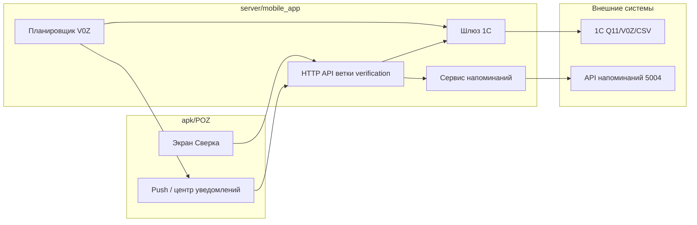

# Сверка: полный план переноса в мобильное приложение

Документ фиксирует **логику раздела «Сверка» из `server/telegram_dealer_bot`** для переноса в `apk/POZ` + `server/mobile_app` без потери смысла функционала для дилеров по всей стране.

### Почему «бухгалтерская сверка» не в этом документе

Это **другой раздел бота**, не меню **`/verification`**.

| | **Сверка → «Сверка финансовая»** | **Финансы → «Заказать бухгалтерскую сверку»** |
|--|--|--|
| **Команда / вход** | `handleVerification` → callback `/verification_financial` | Раздел финансов, `handleFinancesAccountingReconciliation` |
| **Код** | `queryLines/verificationOrder/verificationOrder.js` | `queryLines/finances/finances.js` |
| **Поведение** | Одно действие: создать напоминание менеджеру (`createReminder`, тип `verificationFinancial`) | Многошаговый сценарий (контрагент и др. поля по этапам), свой текст напоминания |
| **Связь с заказами / 1С по INN** | Нет, только заявка менеджеру | Нет в том же виде, что сверка заказов; логика привязана к ветке «Финансы» |

Я **намеренно не включал** подраздел **«Финансы»** сюда, чтобы не смешивать экран **«Сверка»** и меню **`/finances`**. Полный план по финансам (бух. сверка, остаток, счёт, холдинг, `V7R`, DaData): **`Бухгалтерская_сверка_полный_план_переноса_в_mobile_app.md`** (заголовок документа — «Финансы», не `/verification`).

---

## 1) Источники текущей логики

| Назначение | Файл |
|------------|------|
| Меню и сценарии сверки | `server/telegram_dealer_bot/queryLines/verificationOrder/verificationOrder.js` |
| Запросы 1С (Q11), парсинг `INN` / `V2R`, cron `V0Z`, разбор CSV | `server/telegram_dealer_bot/helpers/api.js` (`sendRequest1C`, `getReconciliationOrders`, `initReconciliationCron`, `processReconciliationResponse`, …) |
| Ввод номера заказа, календарь по дате | `server/telegram_dealer_bot/routes/auth.js` |
| Команды callback | `server/telegram_dealer_bot/helpers/chatCommandHandler.js` |
| Сброс сессии | `server/telegram_dealer_bot/helpers/buttonCancel.js` |
| Подключение cron при старте бота | `server/telegram_dealer_bot/index.js` |

Связанные функции и точки интеграции:

- `handleVerification`, `handleVerificationFinancial`, `handleVerificationOrders`, `handleVerificationOrdersByDate`, `handleVerificationOrdersStatus`
- `sendRequest1C(sScan, date)`, `getMppByCompany`, `createReminder`
- `getReconciliationOrders('V0Z')`, `processReconciliationResponse`, `groupOrdersByCompanies`, `sendGroupedReconciliationMessages`

---

## 2) Что делает раздел «Сверка» (смысл для пользователя)

Раздел помогает дилеру:

1. **Запросить финансовую сверку у менеджера** — без выгрузки из 1С: создаётся задача (напоминание) ответственному по компании.
2. **Получить список заказов для сверки по ИНН** — неотгруженные / сверочный перечень в формате, который отдаёт 1С по префиксу **`INN{ИНН}`**; в боте результат дополнительно уходит в **Excel** и логически совпадает с текстовыми строками «Номер заказа, … Дата».
3. **То же с отбором по дате отгрузки** — пользователь выбирает дату (в TG — календарь), в 1С уходит запрос с суффиксом даты в протоколе Q11 (см. ниже), затем клиент может **отфильтровать** строки по выбранной дате.
4. **Узнать статус конкретного заказа** — ввод номера заказа, запрос **`V2R{номер}INN{ИНН}`**, ответ — краткая текстовая сводка из полей, обёрнутых в `;…;` в ответе 1С.
5. **(Фоново, по расписанию)** Получать **напоминания о сверке заказов** — сервер раз в день запрашивает пакет по **`V0Z`**, сопоставляет записи с компаниями и рассылает сообщения в Telegram. В мобильном приложении этот механизм нужно заменить на **push / ленту уведомлений**, иначе ценность cron для пользователя POZ теряется.

---

## 3) Данные: что уходит и что приходит

### 3.1 Общий транспорт к 1С (как сейчас в боте)

Интерактивные сценарии используют **`sendRequest1C(sScan, date)`**:

- **Без даты:** отправляется кадр вида `Q11\x01EB35000999\x02\t{sScan}\r` (кодировка windows-1251).
- **С датой:** `{sScan}D{date}`, где `date` — строка формата **`DD.MM.YYYY`** (в коде сверки по дате она собирается из `YYYY-MM-DD` календаря без сдвига часового пояса).

Ответ декодируется из windows-1251; дальше ветвление по префиксу `sScan` (`INN`, `V2R`, `V6R`, …).

**Замечание для переноса:** в документе по рекламации уже зафиксирован переход на **единый шлюз 1С в `server/mobile_app`**. Все новые вызовы из POZ должны идти через этот шлюз с теми же семантическими параметрами (`scan`, опционально `date`), без прямого `net.Socket` в коде ветки.

---

### 3.2 Сверка по заказам (список по ИНН)

| Направление | Содержание |
|-------------|------------|
| **Запрос** | `sScan = "INN" + companyInn` (ИНН из сессии авторизованного дилера). Опционально второй аргумент `date` — `DD.MM.YYYY` для фильтра на стороне 1С (как в текущем боте). |
| **Ответ (после разбора в `sendRequest1C`)** | Для строк, начинающихся с `INN`, 1С отдаёт набор строк; каждая валидная строка превращается в **одну текстовую строку** с полями через запятую: `Номер заказа: …, Наименование: …, Сумма: …, Адрес: …, Дата: …`. Исходный разделитель в протоколе — **двоеточия** между полями; адрес может содержать запятые, поэтому в Excel-парсере бота адрес собирается как «всё между суммой и датой». |
| **Ошибка / пусто** | `false` или нестроковый ответ — трактуется как отсутствие данных (для сценария по дате показывается сообщение «не найдено заказов»). |

**Дополнительно в боте:** из той же строки ответа строится **XLSX** с колонками: Номер заказа, Наименование, Сумма, Адрес, Дата отгрузки. Для мобилки разумная замена — **таблица/карточки + опциональная выгрузка** (файл или «Поделиться» позже).

---

### 3.3 Сверка по заказам с выбором даты

| Направление | Содержание |
|-------------|------------|
| **Ввод пользователя** | Дата в UI: желательно хранить как **`YYYY-MM-DD`** (как `selectedVerificationDate` в боте), отображать пользователю в `ДД.MM.ГГГГ`. |
| **Запрос** | Тот же `INN{ИНН}`, второй параметр `sendRequest1C` — **отформатированная дата `DD.MM.YYYY`**. |
| **Ответ** | Как в п. 3.2; в боте дополнительно **клиентский фильтр**: остаются только строки, у которых дата в хвосте совпадает с выбранной `YYYY-MM-DD`. |

---

### 3.4 Статус заказа

| Направление | Содержание |
|-------------|------------|
| **Запрос** | `sScan = "V2R" + номерЗаказаТекстом + "INN" + companyInn` |
| **Ответ** | Из тела ответа извлекаются фрагменты вида `;…;`, склеиваются через запятую в **одну строку** для показа пользователю. Если нечего извлечь — `false` → в боте: «Заказ … не обнаружен». |

Для мобильного UI удобно распарсить эту строку в **пары поле/значение** или секции, если формат стабилен (уточнить по реальным ответам 1С на стенде).

---

### 3.5 Сверка финансовая (заявка менеджеру)

Не идёт в 1С за таблицей. Вызывается **`createReminder`** (HTTP POST в API напоминаний, как в боте).

**Передаваемые поля (логика):**

- `userId` — из `getMppByCompany(sessionData.companyId)` (ответственный менеджер по компании).
- `typeReminders`: `'verificationFinancial'`.
- `textCalc`: `'Финансовая сверка!'`
- `priority`: `'средний'`
- `title`: строка с названием компании, `chatId`, именем пользователя из TG — **в POZ заменить на идентификаторы пользователя/дилера из мобильной авторизации**.
- `tags`, `links` — как в боте (тег Telegram и пустые ссылки).

**Принимается:** успех/ошибка от API напоминаний; пользователю показывается сообщение об отправке запроса менеджеру.

---

## 4) Cron: сверка заказов (`V0Z`)

### 4.1 Где включается

- `initReconciliationCron(bot, cronManager)` в `api.js`
- Регистрация в `index.js`: задача с ключом `reconciliation`
- **Расписание:** `35 9 * * *` — каждый день в **09:35** (серверное время; при переносе уточнить часовой пояс и ожидания бизнеса).

### 4.2 Что делает задача

1. Вызывает **`getReconciliationOrders('V0Z')`** (таймауты, буферизация, возможен разбор **CSV по сетевому пути** из ответа 1С — см. код).
2. Получает массив объектов вида:

   ```text
   { id, name, inn, date, address, orderName }
   ```

   (поля заполняются из строк CSV / fallback-парсера ответа; `orderName` — наименование заказа / АВ, может быть пустым).

3. **`processReconciliationResponse(response, bot)`**:
   - группирует заказы по компаниям: `groupOrdersByCompanies` ищет компанию по **ИНН**, иначе по **имени**, затем получает **привязанный chatId** дилера;
   - для каждого chatId формирует сообщения (до **10 заказов** на сообщение) через `formatReconciliationMessage` и отправляет в Telegram.

### 4.3 Смысл для мобильного приложения

| Telegram сейчас | POZ (целевое) |
|-----------------|---------------|
| Сообщения в чат бота | **Push-уведомление** и/или **экран «Сверка / уведомления»** со списком заказов |
| Привязка через `company.id` → chatId | Привязка через **учётную запись пользователя / токен устройства** и те же правила, что и для рекламаций: данные только своей организации |
| Cron крутится в процессе бота | Cron или планировщик в **`server/mobile_app`** (или общий worker), который кладёт события в очередь и триггерит FCM/APNs |

Текст для пользователя (смысл): напоминание проверить заказы на сверку, **дата отгрузки ориентировочная** — как в подписи к сообщениям бота.

---

## 5) Схема реализации переноса

Ниже — целевая архитектура в духе плана по рекламации: **ветка в `server/mobile_app` + экраны в POZ**, без дублирования сырого TCP в каждой фиче.



### 5.1 Слои

1. **API mobile_app** — эндпоинты по сценариям: список сверки по ИНН, с датой, статус заказа, финансовая заявка; плюс (опционально) выдача «ленты» последних cron-событий для пользователя.
2. **Шлюз 1С** — единая точка: формирование `Q11`…, кодировка, таймауты, парсинг ответов `INN` / `V2R`, опционально обработка `V0Z`/CSV на сервере (как сейчас или упрощённо — по решению команды).
3. **Авторизация** — все запросы только в контексте **своего** `companyInn` / `companyId`; не принимать ИНН из тела запроса без проверки соответствия профилю (как для рекламаций).
4. **Cron** — вынести из процесса Telegram-бота в сервис mobile_app; результат — запись в БД/очередь + **push** вместо `bot.sendMessage`.

### 5.2 Паритет с ботом (чеклист)

- [ ] Сверка по заказам без даты (`INN`)
- [ ] Сверка по заказам с датой (`INN` + `D` + дата, клиентский фильтр при необходимости)
- [ ] Статус заказа (`V2R…INN…`)
- [ ] Финансовая сверка → `createReminder` с типом `verificationFinancial`
- [ ] Ежедневная рассылка по данным `V0Z` с тем же составом полей (`id`, `date`, `address`, `orderName`, …)
- [ ] Обработка пустых ответов и таймаутов без падения процесса

---

## 6) Удобный интерфейс в мобильном приложении (POZ)

Принципы: **крупные зоны нажатия**, **понятные статусы загрузки**, работа на слабом интернете, **без «простыни» текста** как в Telegram.

### 6.1 Навигация раздела

Рекомендуется один хаб **«Сверка»** с карточками действий (как пункты меню бота):

- **Сверка по заказам** — сразу запрос по текущей компании пользователя.
- **По дате отгрузки** — экран выбора даты (нативный date picker или календарь), затем тот же список с подзаголовком выбранной даты.
- **Статус заказа** — поле ввода номера + кнопка «Узнать»; результат в **карточке** с возможностью скопировать номер заказа.
- **Финансовая сверка** — один экран: краткое описание + кнопка «Отправить запрос менеджеру» + подтверждение успеха.

Дополнительно (если реализован cron):

- **Уведомления о сверке** — список последних напоминаний с датой и количеством заказов; тап открывает детализацию.

### 6.2 Отображение списка заказов

Вместо Excel и разбивки на 4096 символов:

- **Список с пагинацией или виртуализацией** (десятки/сотни строк).
- **Карточка заказа:** номер (жирно), наименование, сумма, адрес (с переносами), дата отгрузки; бейдж «ориентировочная дата», если это правило бизнеса.
- **Поиск/фильтр** по номеру заказа и по дате — снижает нагрузку на пользователя в полях.

### 6.3 Выгрузка

- Опциональная кнопка **«Сохранить / Поделиться»**: сформировать файл на сервере или клиенте (без обязательности в первой версии).
- Если Excel не нужен бизнесу на телефоне — достаточно **PDF или CSV** одной кнопкой.

### 6.4 Ошибки и доступность

- Явные сообщения: «Нет заказов», «Заказ не найден», «Сервис временно недоступен, повторите позже».
- Не показывать сырой ответ 1С пользователю; логировать на сервере.
- Учитывать **разные размеры экранов** и масштаб шрифта (дилеры по стране).

---

## 7) Связь с документом по рекламации

Использовать те же правила:

- единый шлюз 1С в `server/mobile_app`;
- авторизация и изоляция данных по компании/пользователю;
- push только там, где есть событие для пользователя (для сверки — в первую очередь **cron `V0Z`** и, при необходимости, ответы по длинным операциям).

После реализации ветки обязательны **регрессионные проверки**: рекламация и остальные разделы POZ не должны ломаться из-за общих модулей.

---

*Документ составлен по коду `telegram_dealer_bot` на момент подготовки плана; при изменении протокола 1С или формата CSV для `V0Z` разделы 3–4 нужно синхронизировать с фактическим поведением стенда.*
